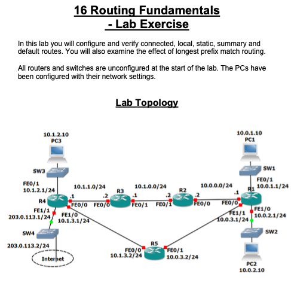

Routing Lab Evidence Log
Title: Routing Fundamentals / Static Routing Validation
Date:
Lab Environment: Cisco Packet Tracer

============================================================

[1] TOPOLOGY / CONTEXT

Devices:

R1

R2

R3

R4

R5

PC1

PC2

PC3

Networks:

10.0.0.0/24
10.0.1.0/24
10.0.2.0/24
10.0.3.0/24
10.1.0.0/24
10.1.1.0/24
10.1.2.0/24
10.1.3.0/24

============================================================

[2] DEVICE CONFIGURATION

R1 Interface Configuration

enable
configure terminal

interface f0/0
ip address 10.0.0.1 255.255.255.0
no shutdown

interface f0/1
ip address 10.0.1.1 255.255.255.0
no shutdown

interface f1/0
ip address 10.0.2.1 255.255.255.0
no shutdown

interface f1/1
ip address 10.0.3.1 255.255.255.0
no shutdown

R2 Interface Configuration

enable
configure terminal

interface f0/0
ip address 10.0.0.2 255.255.255.0
no shutdown

interface f0/1
ip address 10.1.0.2 255.255.255.0
no shutdown

R3 Interface Configuration

enable
configure terminal

interface f0/1
ip address 10.1.0.1 255.255.255.0
no shutdown

interface f0/0
ip address 10.1.1.2 255.255.255.0
no shutdown

R4 Interface Configuration

enable
configure terminal

interface f0/0
ip address 10.1.1.1 255.255.255.0
no shutdown

interface f0/1
ip address 10.1.2.1 255.255.255.0
no shutdown

interface f1/0
ip address 10.1.3.1 255.255.255.0
no shutdown

R5 Interface Configuration

enable
configure terminal

interface f0/0
ip address 10.1.3.2 255.255.255.0
no shutdown

interface f0/1
ip address 10.0.3.2 255.255.255.0
no shutdown

============================================================

[3] STATIC ROUTE CONFIGURATION

R1 Static Routes

ip route 10.1.0.0 255.255.255.0 10.0.0.2
ip route 10.1.1.0 255.255.255.0 10.0.0.2
ip route 10.1.2.0 255.255.255.0 10.0.0.2
ip route 10.1.3.0 255.255.255.0 10.0.0.2

R2 Static Routes

ip route 10.0.1.0 255.255.255.0 10.0.0.1
ip route 10.0.2.0 255.255.255.0 10.0.0.1
ip route 10.0.3.0 255.255.255.0 10.0.0.1

ip route 10.1.1.0 255.255.255.0 10.1.0.1
ip route 10.1.2.0 255.255.255.0 10.1.0.1
ip route 10.1.3.0 255.255.255.0 10.1.0.1

============================================================

[4] ROUTE VERIFICATION

Command

show ip route

Expected Result

Connected routes appear with C

C 10.0.0.0 is directly connected
C 10.0.1.0 is directly connected

Static routes appear with S

S 10.1.0.0 via 10.0.0.2

Evidence Screenshot

============================================================

[5] CONNECTIVITY TEST

PC1 to PC2

ping 10.0.2.10

Result

Success rate is 100 percent

PC1 to PC3

ping 10.1.2.10

Result

Success rate is 100 percent

Evidence

============================================================

[6] PATH VERIFICATION

Traceroute

tracert 10.1.2.10

Expected Path

PC1 → R1 → R2 → R3 → R4 → PC3

Evidence

============================================================

[7] SUMMARY ROUTE TEST

Remove individual routes on R1

no ip route 10.1.0.0 255.255.255.0 10.0.0.2
no ip route 10.1.1.0 255.255.255.0 10.0.0.2
no ip route 10.1.2.0 255.255.255.0 10.0.0.2
no ip route 10.1.3.0 255.255.255.0 10.0.0.2

Add summary route

ip route 10.1.0.0 255.255.0.0 10.0.0.2

============================================================

[8] LONGEST PREFIX MATCH TEST

Add specific route

ip route 10.1.3.0 255.255.255.0 10.0.3.2

Routing Table

S 10.1.0.0/16
S 10.1.3.0/24

Traffic destined for 10.1.3.x prefers the /24 route due to longest prefix match.

============================================================

[9] FINAL VERIFICATION

Connectivity confirmed:

PC1 → PC2 ✔
PC1 → PC3 ✔
PC2 → PC3 ✔

Traceroute confirms correct routing path.

Routing lab successfully validated.
