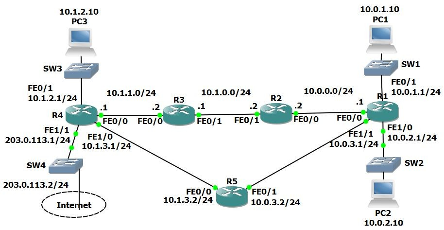

# Lab: Routing Behavior & Failover Analysis

## Objective

Analyze routing behavior and verify network failover under different conditions.

---

## Topology

* R1–R5, PC1–PC3
* Multiple routed subnets (10.0.x.x / 10.1.x.x)



---

## Scenario

Simulated a multi-router network to observe:

* Route selection across protocols
* Behavior during link failure
* Connectivity issues caused by missing routes

---

## Key Observations

* Different routing protocols select paths based on metrics and administrative distance
* When a primary link fails, traffic reroutes through an alternate path
* Missing route entries result in traffic being dropped at intermediate routers

---

## Troubleshooting Example

### Problem

End devices could not communicate across networks (PC3 → PC1 failed).

---

### What I Checked

* Verified default gateway reachability
* Used `tracert` to identify failure point (traffic stopped at R3)
* Reviewed routing tables on intermediate routers

---

### Root Cause

* R3 was missing a route to the 10.1.2.0/24 network

---

### Fix

```cisco id="fix001"
ip route 10.1.2.0 255.255.255.0 10.1.1.1
```

---

### Verification

* Successful ping between PC3 and PC1
* Routing table updated with correct path
* End-to-end connectivity restored

---

## Key Takeaways

* Static routing requires complete path configuration
* Missing routes cause traffic to fail at intermediate hops
* Traceroute is effective for isolating failure points


